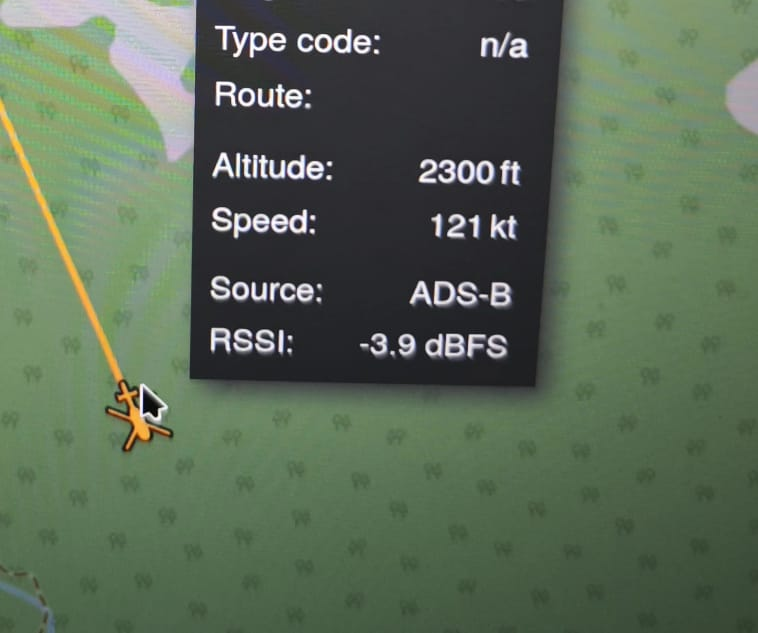

# An ADS-B one-command stack for nix (readsb + tar1090)



A **reproducible, one-command ADS-B receiver** using Nix flakes.

This runs:
- **readsb** — decodes ADS-B from an RTL-SDR dongle
- **tar1090** — static web UI for viewing aircraft in real time

Everything is wired together so it works with **`nix run`**.

---

## Requirements

- Nix with flakes enabled  
- RTL-SDR dongle (RTL2832U / Nooelec etc.)
- Antenna suitable for **1090 MHz**
- kill and other SDR processes running (gqrx, SDR++, etc.)

---

## Run

From this directory:

```bash
nix run
```

Then open:

```
http://localhost:8080
```

---

## What it does

- Runs `readsb` using RTL-SDR
- Writes JSON output to a local runtime directory
- Serves the tar1090 web UI over HTTP
- Cleans up on exit

No system services, no global installs.

---

## Troubleshooting

### Page loads but shows “Problem fetching data”
- `readsb` is running but **no aircraft are being received**
- Check antenna placement (near window, outdoors if possible)
- Wait a few minutes — ADS-B is bursty

### “Device or resource busy”
- Another SDR program is using the dongle
- Quit **gqrx**, **SDR++**, **dump1090**, etc.
- Unplug and re-plug the USB dongle

### Port 8080 already in use
- Something else is listening on 8080
- Stop it, or change the port in the flake script

### No aircraft at all
- Verify you are near air traffic and not in the middle of middle-earth
- Poor antennas often work for FM but **not** 1090 MHz
- ADS-B needs line-of-sight

---

## Notes

- tar1090 is **UI only** — all live data comes from readsb
- This setup is intended for local experimentation
