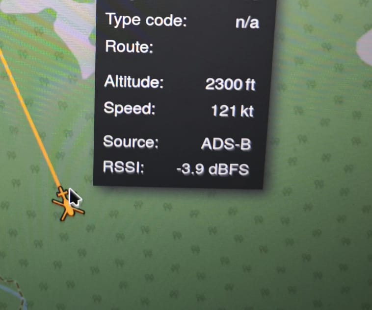

# An ADS-B one-command stack for nix (readsb + tar1090)



A **reproducible, one-command ADS-B receiver** using Nix flakes.

This runs:
- **readsb** — decodes ADS-B from an RTL-SDR dongle
- **tar1090** — static web UI for viewing aircraft in real time

Everything is wired together so it works with **`nix run`**.

---

## Requirements

**Software**

- Nix with flakes enabled
- Port 8080 free (the script refuses to start otherwise)
- No other SDR process holding the dongle (gqrx, SDR++, another readsb)

**Hardware**

- RTL-SDR dongle (RTL2832U / Nooelec etc.)
- Antenna cut for **1090 MHz** — a quarter-wave monopole is only **69 mm**.
  An antenna that works well on FM will usually hear nothing at 1090 MHz.
- A monopole needs a **ground plane**: a metal surface >= ~140 mm across, or
  four 69 mm radials sloped down at 45 degrees. Without one the pattern tilts
  skyward and the coax braid radiates.
- Mount **vertically** — ADS-B is vertically polarised.

**System access**

The dongle appears as a raw USB device, so you need permission to open it:

- Your user must be in the `plugdev` group (log out and back in after adding):
  ```bash
  id -nG | tr ' ' '\n' | grep -x plugdev   # should print: plugdev
  ```
- udev rules for RTL-SDR must be installed. On NixOS:
  ```nix
  hardware.rtl-sdr.enable = true;   # installs rules and creates the group
  ```
- The kernel DVB driver must **not** claim the dongle. If `lsmod | grep
  dvb_usb_rtl28xxu` shows anything, blacklist it:
  ```nix
  boot.blacklistedKernelModules = [ "dvb_usb_rtl28xxu" ];
  ```

Quick check that the hardware is usable at all:

```bash
nix shell nixpkgs#rtl-sdr -c rtl_test -t
```

It should list the tuner and its gain values with no `usb_claim_interface`
errors.

---

## Configuration

Personal settings live in **`site.env`**, which is **gitignored** so your
coordinates never enter git history. Copy the template and edit it:

```bash
cp site.env.example site.env
$EDITOR site.env
```

It is searched for in two places, first hit wins:

1. `./site.env` — per-checkout
2. `$XDG_CONFIG_HOME/adsb-1090/site.env` — per-machine, survives re-clones

| Setting | Default | What it does |
|---|---|---|
| `LAT` / `LON` | unset | Position of the **antenna**. Strongly recommended — see below. |
| `GAIN` | `49.6` | Fixed tuner gain in dB. Must not be `auto` — see below. |
| `PREAMBLE` | auto | Demodulator sensitivity, 40-400. Lower = more sensitive, more CPU. Chosen from core count if unset. |
| `PORT` | `8080` | Web UI port. |

Precedence is **environment variable > `site.env` > built-in default**, so you
can override for a single run without editing anything:

```bash
GAIN=44.5 nix run .
PORT=8090 nix run .
```

The startup banner echoes which config file was used, so you can always see
what is in effect.

### Why `LAT`/`LON` matter

Without a receiver position, readsb can only place an aircraft using *global
CPR*, which needs a matched **odd/even message pair within ~10 seconds**. On a
weak or sparse signal those pairs frequently never arrive, so aircraft are
heard but never plotted — the map stays empty while the message counter climbs.

With a position set, readsb uses *local CPR* and **a single position message is
enough**. On a marginal site this is the difference between an empty map and
live tracks. It also centres the tar1090 map on you and draws range rings.

Use the position of the **antenna**, not the house — range rings are measured
from it, and MLAT (if you ever feed one) needs metre-level accuracy.

### Why `GAIN` is fixed and not `auto`

readsb's autogain repeatedly rewrites the R820T gain register while the USB
bulk stream is running. On this hardware that stalls the control endpoint:

```
rtlsdr_demod_write_reg failed with -9        <- LIBUSB_ERROR_PIPE
r82xx_write: i2c wr failed=-9 reg=05 len=1
rtlsdr: setting tuner gain failed
```

Every gain-set fails, so **gain is never applied at all** and the tuner sits at
minimum — the receiver decodes almost nothing. Pinning the gain avoids the
control transfer entirely. Symptom to watch for: `-9` errors in the output, or
`messages` climbing in `aircraft.json` while gain was never confirmed set.

---

## Running on another machine

The flake is architecture-independent (`eachDefaultSystem`), so **`x86_64-linux`
and `aarch64-linux` both work** — including an Apple Silicon Mac running Asahi
Linux. Nothing is pinned to a particular host.

To move it:

```bash
git clone git@github.com:fiq/sdr-plane-tracker-flake.git
cd sdr-plane-tracker-flake
cp site.env.example site.env      # coordinates are NOT in the repo
$EDITOR site.env
nix run .
```

If you run it on several machines at the same site, put the config in
`~/.config/adsb-1090/site.env` once instead and every checkout picks it up.

Things that adapt automatically:

- **`PREAMBLE`** scales to the host — a desktop gets the most sensitive
  setting, a small board gets a cheaper one, so a weak host is not pegged.
- **Port checking** uses `ss` where present and falls back to `lsof`.
- **USB "busy dongle" checks** are skipped where `/dev/bus/usb` does not exist.
- **Linux-only tooling** (`usbutils`) is only pulled in on Linux.

Still required on the new host: `plugdev` membership, RTL-SDR udev rules, and
the `dvb_usb_rtl28xxu` module not claiming the dongle — see *Requirements*.

### Does the host hardware matter?

Essentially no. The readsb demodulator is light and effectively
single-threaded; any modern machine — a Ryzen desktop, an M2 under Asahi, even
a Raspberry Pi — has ample headroom at the most sensitive preamble setting.
**Reception is limited by antenna siting, not by CPU.** Choose the host on
practical grounds instead: something low-power that can stay on 24/7 is worth
more than raw speed, since ADS-B only shows you aircraft that are overhead
while it happens to be running.

---

## Run

From this directory:

```bash
nix run
```

Then open:

```
http://localhost:8080
```

---

## What it does

- Runs `readsb` using RTL-SDR
- Writes JSON output to a local runtime directory
- Serves the tar1090 web UI over HTTP
- Cleans up on exit

No system services, no global installs.

---

## Troubleshooting

### Page loads but shows “Problem fetching data”
- `readsb` is running but **no aircraft are being received**
- Check antenna placement (near window, outdoors if possible)
- Wait a few minutes — ADS-B is bursty

### “Device or resource busy”
- Another SDR program is using the dongle
- Quit **gqrx**, **SDR++**, **dump1090**, etc.
- Unplug and re-plug the USB dongle

### Port 8080 already in use
- Something else is listening on 8080
- Run on another port: `PORT=8090 nix run .`, or set `PORT` in `site.env`

### Messages are climbing but no aircraft appear on the map
The commonest cause is **`LAT`/`LON` not set** — readsb is decoding fine but
cannot resolve positions. See *Why `LAT`/`LON` matter* above. Check with:

```bash
python3 -c "import json;d=json.load(open('run/webroot/data/aircraft.json'));\
print('messages',d['messages'],'aircraft',len(d['aircraft']))"
```

Many messages plus zero aircraft over several minutes points squarely at this.

### No aircraft at all
- Verify you are near air traffic and not in the middle of middle-earth
- Poor antennas often work for FM but **not** 1090 MHz
- ADS-B needs line-of-sight

---

## Diagnostics

Work outward from the dongle; each step isolates one layer.

**1. Is the hardware usable?**

```bash
nix shell nixpkgs#rtl-sdr -c rtl_test -t
```

Lists the tuner and gain table. Failure here means permissions, udev, or the
DVB driver — not this flake.

**2. Does RF reach the ADC?**

```bash
nix shell nixpkgs#rtl-sdr -c rtl_power -f 88M:108M:100k -g 30 -i 8 -1 fm.csv
```

FM broadcast is enormously strong; peaks 15+ dB above the noise floor prove the
antenna, coax and ADC all work. Useful because it tests the whole chain with a
signal that is always present.

> **`rtl_power` cannot see ADS-B.** Squitters are ~120 us bursts at a very low
> duty cycle, and `rtl_power` averages power across its integration window, so
> the bursts are smeared into the noise floor. A flat trace at 1090 MHz is
> **not** evidence of a bad antenna — it is the expected result even on a
> perfectly working receiver. Judge 1090 MHz by decoded message counts only.

**3. Is the receiver decoding?**

```bash
python3 -c "import json;l=json.load(open('run/webroot/data/stats.json'))['total']['local'];\
print(l.get('accepted'), 'signal', l.get('signal'), 'strong', l.get('strong_signals'))"
```

`accepted` is `[clean, 1-bit-corrected]`. Both climbing means real ADS-B with
valid CRC. `signal` is the mean level of *received messages* in dBFS — judge it
only on a decent sample of real traffic, since a couple of close aircraft in an
otherwise empty sky will skew it badly.

---

## Antenna siting

At 1090 MHz radio behaves like light: if the antenna cannot see the aircraft,
it cannot hear it. Siting dominates every software setting.

Obstruction matters far more than raw height. Earth curvature is almost
irrelevant, because an aircraft at FL350 is already ~425 km over the horizon:

| Antenna height | Own horizon | Total range to FL350 |
|---|---|---|
| 2 m | 5.8 km | 431 km |
| 10 m | 13.0 km | 438 km |

Raising 2 m -> 10 m gains only ~7 km geometrically. What it actually buys you is
**clearing obstructions**. A 12 m tree line 40 m away subtends 17 degrees, and
cuts your usable range at FL350 from ~430 km to ~36 km — a 12x loss.

Rough one-pass attenuation at 1090 MHz:

| Material | Loss | Effect |
|---|---|---|
| Timber, plasterboard | 2-5 dB | Barely noticed |
| Old single glazing | ~1 dB | Irrelevant |
| Stone / masonry | 20-40 dB | Effectively opaque |
| Low-E double glazing | 25-35 dB | Metal coating; near-opaque |
| Corrugated iron / foil-backed insulation | 50+ dB | Total block |

Consequences worth knowing:

- **A metal roof rules out attic mounting entirely** — it reflects everything,
  and it faces the direction the aircraft are.
- **But a metal roof is an excellent ground plane.** A magnetic-base antenna
  near the ridge gets a ground plane larger than anything you could buy, with
  no drilling. Corrugations are ~20 mm against a 275 mm wavelength, so it
  behaves as a flat sheet.
- **A window mount works, but is directional.** The eave cuts off high angles
  and the building blocks the rear, leaving roughly 40% of the sky. Distant
  aircraft arrive at low angles and still get through, so range in the favoured
  direction stays good — it is overhead traffic you lose. Bracketing the
  antenna out from the wall by 20-30 cm widens the wedge noticeably.

---

## Notes

- tar1090 is **UI only** — all live data comes from readsb
- This setup is intended for local experimentation
